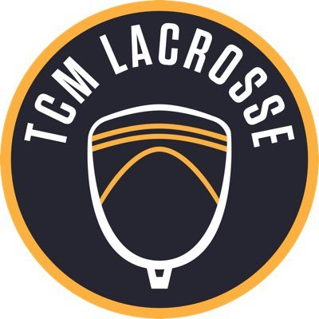

I am a Computer Science Graduate Student at Indiana University Bloomington. My research interests include Machine Learning, Deep Learning, and Computer Vision.

My goal is to create AI applications that will help improve our way of living. Right from getting recommendations about what to watch next on Netflix to asking our Voice Assistant whether we need to carry an umbrella today, AI plays an important role in our lives. Yet the challenge of AI is far from solved. AI lacks reasoning and common sense knowledge. If we could solve these challenges, we could have a much richer experience and most of our day-to-day chores could potentially be handled by AI.

I completed my undergraduate in Computer Engineering from K. J. Somaiya College of Engineering in India. My capstone project was to make an intelligent software to provide a walking aid to the visually impaired. The deep learning based model would inform the user about the obstalces (such as table, chair, etc.) that are in their path, which would help the user walk with ease.

Apart from Technology, I love to play Soccer and Table-Tennis. I love to explore new places and try out different cuisines. 

Education
-----

**Master's in Computer Science, Indiana University**
#### August 2019 - Present
-----
I am currently doing my Master's in Computer Science from Indiana University.  
<strong>CGPA: </strong> 4.0/4.0  
<strong>Coursework:</strong>
* <strong>Fall'19: </strong>CSCI-B 551 Elements of AI, CSCI-P 556 Applied Machine Learning, ENGR-E 533 Deep Learning Systems  
* <strong>Spring'20: </strong>CSCI-B 657 Computer Vision, CSCI-B 659 Reinforcement Learning, CSCI-P 536 Advanced Operating Systems

<strong>Labs/Reading Groups: </strong>IU Computer Vision Lab, Computer Vision Reading Group

-----

**B.Tech in Computer Engineering, K. J. Somaiya College of Engineering**
#### 2015 - 2019 
-----
I did my Bachelor of Technology in Computer Engineering from K. J. Somaiya College of Engineering. 
 
<strong>CGPA:</strong> 3.5/4.0   
<strong>Relevant coursework:</strong> Artificial Intelligence, Machine Learning, Neural Networks, Applied Mathematics, Image Analysis, Data Warehousing and Mining, Fundamentals of Programming, Data Structures, Algorithms, Computer Architecture, Operating Systems  

Experience
-----

**Research Assistant, IU Computer Vision Lab**
#### June 2020 - Present
-----
* I am a part of [Prof. David Crandall's](https://homes.luddy.indiana.edu/djcran/) research group. I am currently working on 3D Reconstruction from single-view and multi-view images.

* I am also responsible for training a novel architecture on various datasets. We were able to achieve state-of-the-art results on the [NYUv2](https://cs.nyu.edu/~silberman/datasets/nyu_depth_v2.html) and the [ScanNet](http://www.scan-net.org/) dataset.

-----

**Machine Learning Intern, TCM Lacrosse**
#### June 2020 - Present
-----
* I am currently working on building an entire Machine Learning pipeline which could track shot placements for the game of Lacrosse. There are two main aspects; ball tracking, and collision detection (detecting when the ball collides with the net).

* I have improved the precision by 0.5 and recall by 0.8 than the previously trained model for the task of collision detection.

* I am also responsible for creating and assigning batches to everyone for annotating the dataset using the [VGG Image Annotator (VIA)](http://www.robots.ox.ac.uk/~vgg/software/via/) and [Make Sense](https://www.makesense.ai/) online tool. 
